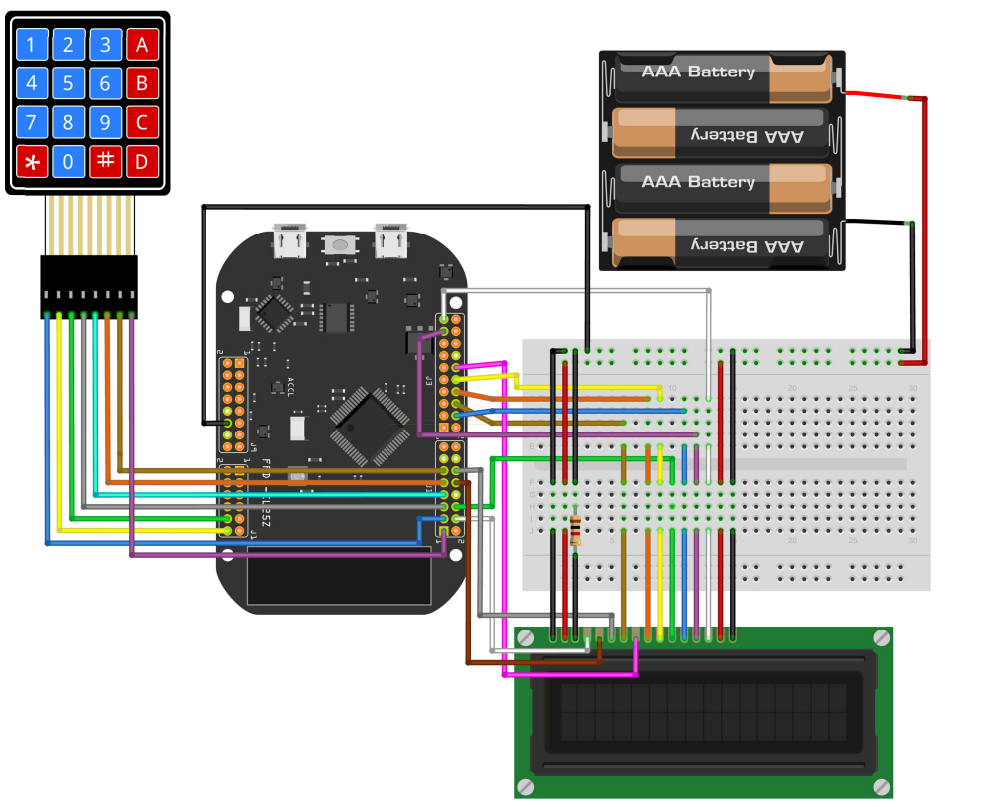

 

 <h1 align="center" id="title">RSA Encryption Algorithm</h1>

  

    ✈An algorithm to encrypt and decrypt given set of numbers using RSA method  
     
     
  

## 💡Concepts Used in This Project

* C programming language in Embedded Systems
* Keil µVision
* I/O ports

## 🎯 Purpose

The aim of this project is to input a number from user and encrypt or decrypt and the number according to user's choice.  

## 🔓 Algorithm & Methodology

RSA is highly used for secure communication like HTTPS and digital signatures. The idea behind RSA is that given two prime numbers p, q; n = pq is extremely hard to factorize. Detailed description of the algorithm can be found [here]([CodeFile/C_major.asm](https://www.math.wichita.edu/discrete-book/section-numtheory-encryption.html)). 'p' and 'q' values are kept as secret by the programmer and can be changed. m is calculated to be: *m = (p − 1)(q − 1)*. Integer 'e' is automatically chosen by the program so that gcd(m, e) = 1. Integer d is calculated so that *ed(mod m) = 1* and *d>0*. The input is taken by a keypad. User inputs A for encryption and D for decryption mode. Then, user inputs the number. Result is displayed on a 16x2 LCD module.

## 🎨 Design Specifications
This design is implemented on FRDM-KL25Z which features ARM® Cortex™-M0+ Core. I/O port connections according to the given schematic. The 1kΩ resistor is changed with 3.3kΩ resistor to change LCD contrast to improve visibility.

## 🏆 Simulation Results

not completed yet

## 🔎 Further Details

Under CodeFile

* You may check the RSA_encyrption.c file  to look at my main code. [here](RSA_encyrption.c)

  

